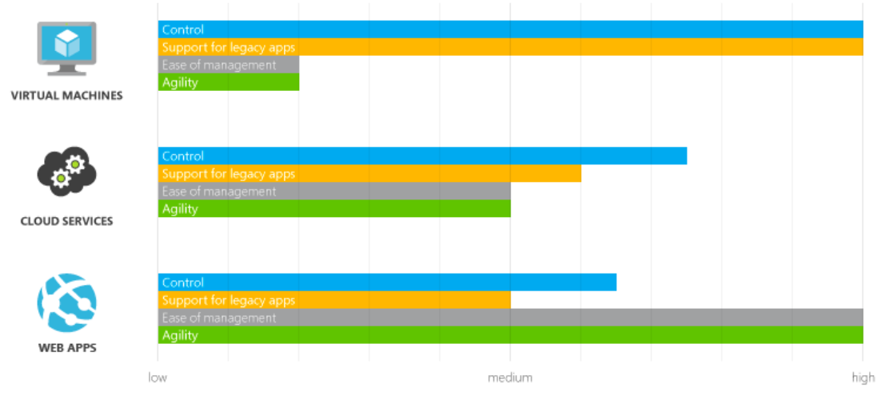

# Project Write-Up
## Udacity Azure Nanodegree - Project 1 (11th July 2020)

### Analyze, choose, and justify the appropriate resource option for deploying the app.

In order to host an application in the Microsoft Azure, there are number ways to do so. Major features include high availability, load balancing, scalability etc. For our Udacity Azure Project - Deploy an Article CMS App to Azure, I had two ways to deploy the app - one by using Web Apps and the other by using Virtual Machines. 

Workflow : I found App Service easier to Navigate whereas VM required more time and efforts for this app.
Scalability : VM is Highly Scalable and so is App Service. 
Availability : VM has less downtime as compared App Service. 
Costs : Comparing the costs between VM and App Services, VM is expensive than that of Web App. 

The official docs provided much clarity on the differences related to costs, scalability, availability, and workflow of VM vs Web App. 
https://docs.microsoft.com/en-us/azure/architecture/guide/technology-choices/compute-decision-tree

I deployed my app using the App Service successfully. Everything was appropriate until I wanted to verify my server configurations and analyze some performance issues. It seems this isn’t possible, since App Service is a managed platform that handles deployment for you. There is no simple way to gain access to the app configuration files once it’s running. However, still I chose to go with App Service because of it’s simplicity, easier deployment and cheaper options. Since my app  required less than 14 GB of RAM and less than 4 vCPUS, we used Azure Web App for migration.

### Assess  app changes that would change your decision.

*Detail how the app and any other needs would have to change for you to change your decision in the last section.*

Using Web App for this project was comparatively easy as mentioned before. The simplicity of deploying the app and cheaper option provided a decent reason to use App service for deployment. 

The App Service is a managed platform. That means, Azure is responsible for application deployment as well as management while the developer only needs to concentrate on app development. Virtual Machines give us full control over application management and deployment. So, If we had projects which required substantial modifications, Virtual machines would have been our choice. 
